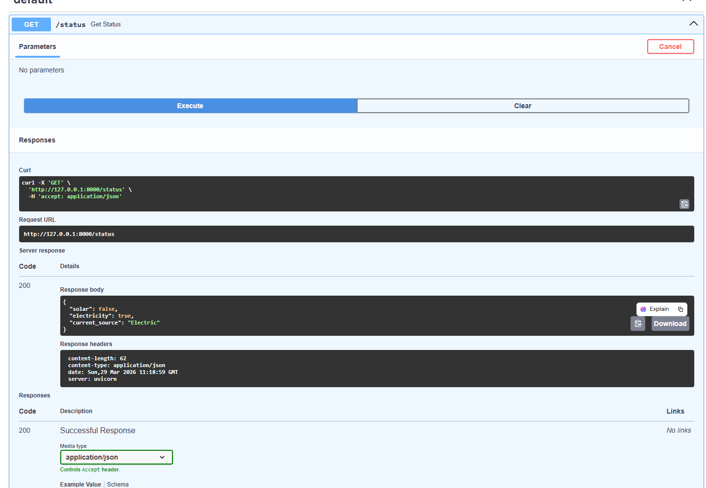

# ⚡🔥 Hybrid Cooking System

<p align="center">
  <b>Smart • Sustainable • Automated Cooking Solution</b><br>
  <i>Switching intelligently between Solar 🌞, Electricity ⚡ and LPG 🔥</i>
</p>

---

## 💡 About The Project

🚀 The **Hybrid Cooking System** is an intelligent energy optimization solution that automatically selects the best available cooking source based on real-time conditions.

It ensures:

* ⚡ Efficiency
* 🌍 Sustainability
* 🔥 Safety

👉 Designed especially for regions with **unreliable electricity and high LPG dependency**, this system brings **smart automation into everyday cooking**.

---

## 🧠 How It Works

```text
🌞 Daytime → Solar Energy  
⚡ Electricity Available → Electric Cooking  
🔥 Backup Mode → LPG  
```

💡 The system continuously evaluates available resources and **automatically switches** to the most optimal source — no manual intervention required.

---

## 🚀 Features

✨ Intelligent Decision Engine
📊 Real-Time Monitoring Dashboard
🔄 Automatic Energy Switching
🌙 Clean & Minimal Dark UI
⚠️ Safety-Oriented Design
☁️ Cloud-Ready Architecture

---

## 🛠️ Tech Stack

| Layer       | Technology Used       |
| ----------- | --------------------- |
| 💻 Backend  | FastAPI               |
| 🌐 Frontend | HTML, CSS, JavaScript |
| ☁️ Cloud    | AWS EC2               |
| 🐳 DevOps   | Docker                |
| 🔁 CI/CD    | GitHub Actions        |

---

## 📸 Demo  

<p align="center">
  
</p>

---

## 🌍 Real-World Impact

🌱 Reduces dependency on LPG
⚡ Handles power outages seamlessly
🌞 Promotes renewable energy usage
🏡 Ideal for smart homes & rural areas

---

## 🔮 Future Scope

🤖 AI-based energy prediction
📱 Mobile application integration
🌐 IoT-enabled real hardware system
📊 Advanced analytics & insights

---

## 👩‍💻 Author

**Kanupriya Prachande**
🚀 Cloud & DevOps Enthusiast

---

<p align="center">
  ⭐ If you like this project, don’t forget to star the repo!
</p>
